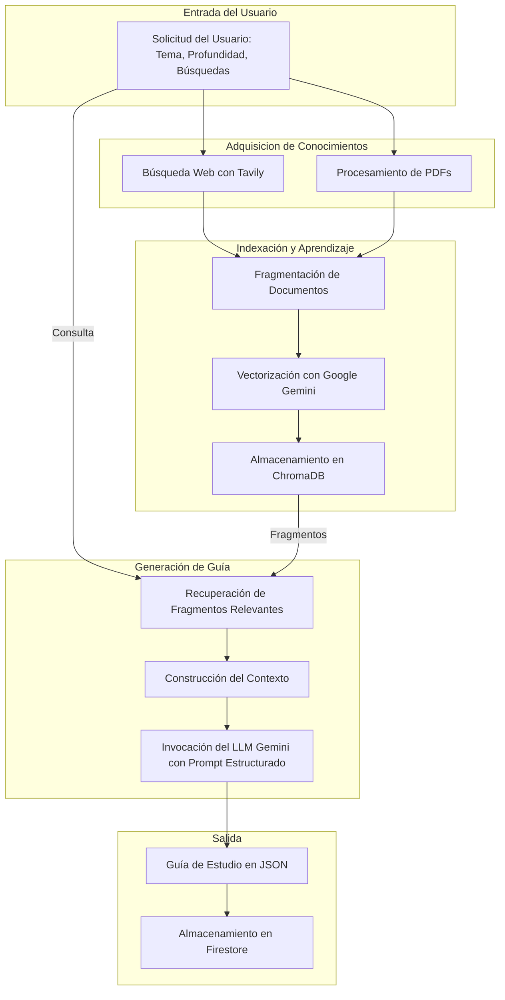

# :robot: Agente IA para Guías de Estudio: Tu Tutor Personalizado

[](https://www.python.org/)
[](https://fastapi.tiangolo.com/)
[](https://www.langchain.com/)
[](https://deepmind.google/technologies/gemini/)
[](https://www.trychroma.com/)
[](https://firebase.google.com/)

Un agente inteligente y autónomo diseñado para transformar la manera en que aprendemos. Esta aplicación FastAPI utiliza el poder de los Grandes Modelos de Lenguaje (LLMs) y técnicas de **Generación Aumentada por Recuperación (RAG)** para crear guías de estudio detalladas, resúmenes coherentes y planes de aprendizaje estructurados a partir de documentos PDF y fuentes de información en línea.

El agente no solo genera contenido, sino que **construye y enriquece su propia base de conocimientos** con cada documento procesado y cada búsqueda realizada, volviéndose más experto y preciso con el tiempo.

## :sparkles: Características Principales

- **Generación Asíncrona:** Solicita una guía de estudio y recibe un ID de tarea. El procesamiento se realiza en segundo plano, permitiéndote consultar el estado y resultado sin bloqueos.
- **Base de Conocimientos Persistente:** Utiliza **ChromaDB** para almacenar y gestionar una base de datos vectorial de toda la información procesada, creando un "cerebro" centralizado y en constante crecimiento.
- **Enriquecimiento con Fuentes Externas:** Integra **Tavily Search API** para realizar búsquedas web avanzadas, asegurando que el contenido generado sea actual y relevante.
- **Procesamiento de PDFs:** Sube tus propios documentos en formato PDF para que el agente los analice y los incorpore a su base de conocimientos.
- **Salida Estructurada y Detallada:** Las guías se entregan en un formato JSON estructurado que incluye un resumen completo, un plan de estudio modular y un listado de fuentes.
- **Gestión de Tareas con Firebase:** Utiliza **Firestore** para registrar y monitorizar el estado de cada solicitud de generación.

## :brain: Flujo de Datos: El Poder de RAG

El núcleo del agente es un sofisticado pipeline de **Generación Aumentada por Recuperación (RAG)**. Este proceso garantiza que el contenido no sea simplemente "imaginado" por el LLM, sino que esté firmemente anclado en la información proporcionada y verificable.



_<p align="center">Un diagrama visual del flujo de datos, desde la entrada del usuario hasta la guía de estudio final.</p>_

### ¿Cómo se hace más inteligente el agente?

La "inteligencia" del agente reside en la **mejora continua de su base de conocimientos**. Con cada PDF subido y cada búsqueda realizada, la información se integra en ChromaDB, haciendo que el agente sea más experto y preciso en sus respuestas.

## :hammer_and_wrench: Stack Tecnológico

- **Backend:** FastAPI
- **Servidor ASGI:** Uvicorn
- **Orquestación IA:** LangChain
- **Modelos de Lenguaje y Embeddings:** Google Generative AI (Gemini)
- **Base de Datos Vectorial:** ChromaDB
- **Búsqueda Web:** Tavily Search API
- **Base de Datos de Tareas:** Google Firestore
- **Gestión de Dependencias:** uv

## :gear: Instalación y Configuración

**Nota:** Este proyecto está diseñado para ejecutarse en un entorno tipo Unix (Linux, macOS, WSL en Windows).

1. **Clonar el repositorio:**

    ```bash
    git clone https://github.com/tu_usuario/study-agent.git
    cd study-agent/backend
    ```

2. **Instalar dependencias con `uv`:**
    Este proyecto utiliza [uv](https://github.com/astral-sh/uv) para la gestión de dependencias.

    ```bash
    uv sync
    ```

3. **Configurar variables de entorno:**
    Crea un archivo `.env` en la raíz del proyecto (`backend/.env`) y añade las siguientes claves:

    ```env
    # Clave de API para los modelos de Google (Gemini)
    GOOGLE_API_KEY="tu_api_key_de_google"

    # Clave de API para la búsqueda web con Tavily
    TAVILY_API_KEY="tu_api_key_de_tavily"

    # Ruta al archivo de credenciales de Firebase (formato JSON)
    # Descárgalo desde la consola de Firebase > Project Settings > Service accounts
    FIREBASE_CRED_PATH="ruta/a/tu/firebase-credentials.json"
    ```

4. **Ejecutar la aplicación:**

    ```bash
    uv run uvicorn main:app --host 0.0.0.0 --port 8000 --reload
    ```

    El servidor estará disponible en `http://localhost:8000`.

## :open_book: Endpoints de la API

La API proporciona varios endpoints para interactuar con el agente.

### `POST /upload-pdfs/`

Sube uno o más archivos PDF para añadirlos a la base de conocimientos del agente.

- **Ejemplo de uso con `curl`:**

  ```bash
  curl -X POST -F "files=@/ruta/a/documento1.pdf" -F "files=@/ruta/a/documento2.pdf" http://localhost:8000/upload-pdfs/
  ```

- **Respuesta Exitosa (200):**

  ```json
  {
    "status": "éxito",
    "message": "2 PDF(s) procesados correctamente.",
    "upload_id": "upload_...",
    "chunks_added": 35,
    "processing_time": 8.2
  }
  ```

### `POST /generate-study-guide-async/`

Inicia la generación asíncrona de una guía de estudio sobre un tema específico.

- **Body (JSON):**

  ```json
  {
    "topic": "El Renacimiento Italiano",
    "search_queries": [
      "artistas clave del Renacimiento",
      "contexto histórico del Renacimiento en Florencia"
    ],
    "depth": "intermedio"
  }
  ```

- **Ejemplo de uso con `curl`:**

  ```bash
  curl -X POST -H "Content-Type: application/json" \
  -d '{
    "topic": "Física Cuántica para Principiantes",
    "depth": "básico"
  }' \
  http://localhost:8000/generate-study-guide-async/
  ```

- **Respuesta (200):**

  ```json
  {
    "message": "Solicitud recibida. La guía se está generando en segundo plano.",
    "guide_id": "guide_...",
    "status_url": "/study-guide/guide_..."
  }
  ```

### `GET /study-guide/{guide_id}`

Consulta el estado y el resultado de una guía generada previamente.

- **Ejemplo de uso con `curl`:**

  ```bash
  curl http://localhost:8000/study-guide/guide_...
  ```

- **Respuesta (Procesando - 202):**

  ```json
  {
    "status": "procesando",
    "current_step": "generación_contenido",
    "message": "La guía se está procesando."
  }
  ```

- **Respuesta (Completado - 200):**
  Un objeto JSON con la guía de estudio completa (`StudyGuideResponse`).

### `DELETE /admin/reset-knowledge-base/`

**¡:rotating_light: Acción destructiva!** Reinicia la base de conocimientos de ChromaDB, eliminando todos los documentos y fragmentos almacenados.

- **Ejemplo de uso con `curl`:**

  ```bash
  curl -X DELETE http://localhost:8000/admin/reset-knowledge-base/
  ```

